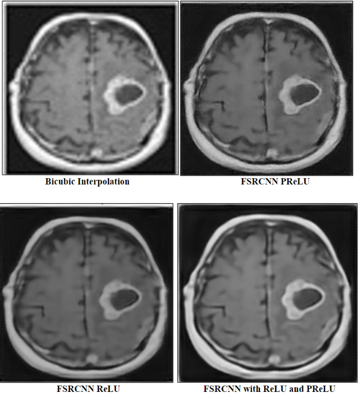

# 🔬 MRI Image Super Resolution App

[Previous sections remain the same until "How It Works"]

## 📸 Results Comparison

### Comparison of Different Enhancement Methods

*Comparison of different super-resolution approaches:*
- **Top Left:** Bicubic Interpolation (Traditional method)
- **Top Right:** FSRCNN with PReLU activation
- **Bottom Left:** FSRCNN with ReLU activation
- **Bottom Right:** FSRCNN with ReLU and PReLU combined

### Key Observations
- 🔍 PReLU activation shows better detail preservation compared to basic interpolation
- 🎯 Enhanced visibility of tumor boundaries and brain structures
- 🎨 Improved contrast and edge definition
- 📊 Better overall image quality than traditional bicubic interpolation

## ⚙️ Model Details

### Model Architecture: FSRCNN with PReLU
- Input: 64x64x1 grayscale image
- Output: 256x256x1 enhanced image
- Key Features:
  - Fast Super-Resolution CNN (FSRCNN) architecture
  - PReLU activation function
  - 4x upscaling factor

## 📁 File Structure
```
project_root/
│
├── app.py              # Main Streamlit application
├── requirements.txt    # Dependencies
├── PRELU.h5           # Pre-trained model
└── README.md          # Documentation
```

## 💻 Usage

1. Start the Streamlit app:
```bash
streamlit run app.py
```

2. Upload an MRI image:
   - Supported formats: JPG, PNG, JPEG, WEBP
   - Recommended input size: 64x64 pixels
   - Grayscale images work best

3. Click "Enhance" to process the image
   - Output will be displayed alongside the input
   - Enhanced image can be downloaded

## ⚠️ Important Notes
- Model path should be updated in the code to match your local setup
- Input images should be grayscale MRI scans
- Best results are achieved with brain MRI images
- Model is optimized for 4x upscaling


## 🤝 Contributing
Contributions are welcome! Please feel free to submit a Pull Request.

## 📄 License
[Your chosen license]

## 🔮 Future Improvements
- Support for batch processing
- Additional upscaling factors
- Enhanced preprocessing options
- Model performance metrics display